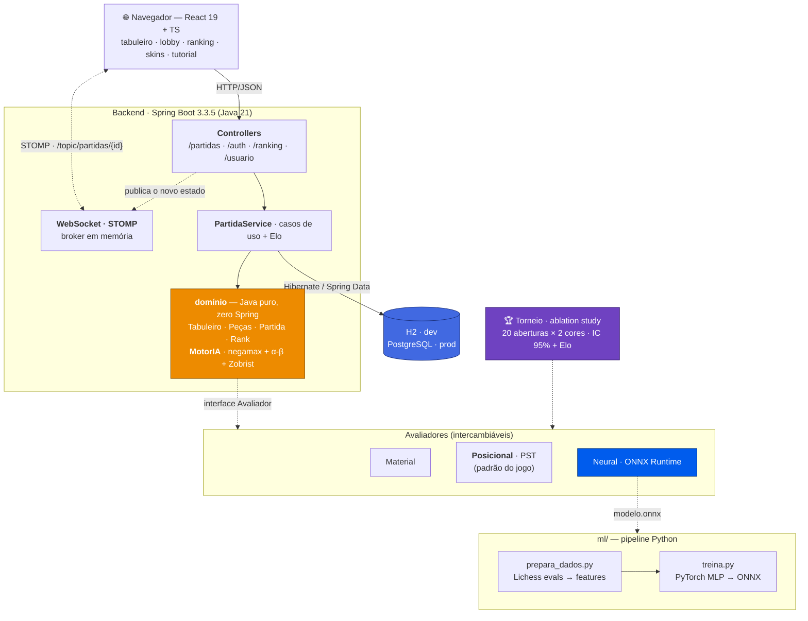

<div align="center">

<h1>♟️ Xadrez</h1>

<p><strong>Jogo de xadrez completo no navegador — regras de verdade, motor de IA próprio e ranking Elo. Com uma rede neural avaliadora que foi treinada, medida contra as heurísticas clássicas… e reprovada com números.</strong></p>

<p>
  
  &nbsp;
  
  
  
  
  
  
  
</p>

</div>

---

## O que é

Um xadrez jogável de ponta a ponta, sem simplificar as regras chatas: roque dos dois lados, *en passant*, promoção com escolha de peça, xeque, xeque-mate e afogamento. Você abre o site e escolhe um dos quatro modos — **2 jogadores** no mesmo aparelho, **contra a IA** em quatro níveis, **online** contra outra pessoa (a partida vale Elo) ou o **tutorial**, que ensina a jogar antes de você levar um mate do pastor. As partidas online nascem no **lobby**: você cria a sala, ela aparece filtrável por faixa de Elo, e o adversário entra pelo link ou pela lista. As jogadas chegam nos dois lados na hora, por WebSocket.

Ganhar sobe seu **Elo** (a mesma matemática da FIDE), e o Elo destrava tudo o mais: seis **ranks** (Iniciante → Grande Mestre), seis **títulos** cosméticos exibidos ao lado do apelido no ranking, cinco **skins de peças** e cinco **temas de tabuleiro**. Há duas tabelas de ranking — o top do site e o top da sua faixa —, login com e-mail ou Google, e um perfil.

Por baixo: **Java 21** com um pacote de domínio que não conhece Spring nem banco, **Spring Boot 3.3.5** (Web + Data JPA + Security + WebSocket) sobre **Hibernate**, **React 19 + TypeScript** no front, **97 testes** rodando em CI a cada push. E um motor de IA escrito do zero — negamax com poda alpha-beta, ordenação MVV-LVA, quiescência, tabela de transposição com hash de Zobrist e aprofundamento iterativo — cuja função de avaliação é **plugável**: material, posicional (piece-square tables) ou **neural**, uma rede treinada em PyTorch sobre a base do Lichess e executada em Java via **ONNX Runtime**.



---

## ✨ Destaques de engenharia

**O domínio não sabe que o Spring existe.** O pacote `dominio` é Java puro: `Tabuleiro`, `Peca`, `Partida`, `MotorIA`, `Rank` — nenhuma anotação, nenhum import de framework, nenhuma noção de banco. As regras do xadrez são testáveis sem subir contexto nenhum (a maior parte dos 97 testes roda em milissegundos), e a troca de H2 por PostgreSQL em produção custou **uma dependência e um arquivo de properties** — zero linha de regra tocada. A persistência entra pela borda: `PartidaMapper` traduz `PartidaEntity` ↔ `Partida`, e o domínio nunca fica sabendo.

**Um motor de xadrez de verdade, camada por camada.** `MotorIA` é negamax com poda alpha-beta, e cada peça que foi acrescentada tem um motivo mensurável: **MVV-LVA** ordena as capturas (dama com peão antes de peão com dama) porque alpha-beta corta muito mais quando o melhor lance vem primeiro; **quiescência** estende a busca só nas capturas ao chegar na folha, para a IA não parar no meio de uma troca e achar que ganhou uma dama (efeito horizonte); **tabela de transposição** indexada por **hash de Zobrist** reaproveita posições já vistas por outra ordem de lances; e **aprofundamento iterativo** busca 1, 2, 3… plies até o relógio acabar, usando o melhor lance da rodada anterior para ordenar a seguinte. O nível de dificuldade não é profundidade fixa — é **orçamento de tempo** (300 ms a 6 s), então a IA aproveita máquina rápida e nunca trava a requisição.

**Concorrência resolvida no formato dos dados, não com locks.** O `MotorIA` é um singleton compartilhado entre requisições. As tabelas de Zobrist são `static final` com seed fixa (imutáveis, portanto thread-safe e reprodutíveis); todo o estado **mutável** da busca — a tabela de transposição — nasce e morre dentro de cada chamada. Nenhum `synchronized`, nenhuma corrida.

**A avaliação virou um ponto de extensão — e aí deu para medir.** `Avaliador` é uma interface de um método só: dê uma nota à posição, sempre na ótica de quem está na vez (o contrato que o negamax espera). Isso permitiu três implementações — `AvaliadorMaterial`, `AvaliadorPosicional` (piece-square tables com *tapered eval*: as tabelas do rei interpolam entre meio-jogo e final conforme o material em campo) e `AvaliadorNeural` — sem a busca saber de nada. Trocar a heurística por uma rede neural **não mudou uma linha do negamax**.

**A rede neural: 780 features na ótica de quem joga.** `AvaliadorNeural` carrega um modelo ONNX e o executa com o ONNX Runtime. A posição vira 780 floats — 12 planos de 8×8, mais direitos de roque, mais a coluna do alvo de en passant — sempre **relativos a quem avalia**: para as pretas o tabuleiro é espelhado e as cores trocadas, como um jogador que gira a mesa. Duas razões: a avaliação depende de quem está na vez (o *tempo* vale décimos de peão), e a nota já sai do ponto de vista certo para o negamax — **não há negação a esquecer**, que é o bug clássico da engine neural que "joga quase bem". A saída é probabilidade de vitória, convertida para centipeões pela escala logística (`cp = 173.7178 · ln(p/(1-p))`). No treino, o grafo ONNX é montado à mão com `onnx.helper` em vez de `torch.onnx.export` — o grafo fica idêntico ao contrato do Java, sem depender de uma API do torch que muda entre versões — e o export é **conferido numericamente** contra o torch antes de virar arquivo.

**A rede perdeu. Está medido, e é por isso que ela não está no jogo.** O `Torneio` é um experimento controlado: os três avaliadores jogam entre si com a **mesma busca** e o **mesmo tempo por lance** — a única variável é a função de avaliação. Como motores determinísticos repetiriam a mesma partida infinitas vezes, a suíte tem **20 aberturas jogadas com as duas cores**, e o placar sai com intervalo de confiança de 95% e diferença de Elo. Resultado após três iterações da rede (v1 → v3): as piece-square tables batem a rede com folga, e **o `AvaliadorPosicional` continua sendo o que joga contra você**. O diagnóstico também é medido: mais dados deram +135 Elo à rede (v1→v2), uma rede maior melhorou o MAE de validação mas **não** a força de jogo (v2→v3) — porque a inferência ONNX custa ordens de magnitude mais por nó e, no mesmo tempo, a rede simplesmente busca mais raso. O gargalo é o **custo por nó**, não o treino. Resultado negativo, quantificado e explicado — é exatamente para isso que um ablation study existe.

**Elo com as arestas que rankings online têm de ter.** `CalculadoraElo` é uma classe pura (sem Spring, sem banco): `K = 32`, mas **K = 64 nas 10 primeiras partidas ranqueadas**, para a conta nova chegar rápido ao seu nível real — e o K é resolvido **por lado**, porque os dois jogadores podem estar em fases diferentes. Há um bônus modesto de maré de vitórias (3ª → +3, 4ª → +6, 5ª+ → +9, com teto) para engajar sem virar alvo de farm. Só pontua partida **online entre dois usuários logados**, e a trava `eloAplicado` garante que uma partida pontue **uma vez só**. O `Rank`, por decisão explícita, **não é coluna no banco**: é derivado do Elo, que é a única fonte de verdade — quando o Elo muda, o rank muda de graça, e não há dois campos para dessincronizar.

---

## 📦 Domínios

<table>
  <thead>
    <tr><th>Pacote</th><th>Responsabilidade</th></tr>
  </thead>
  <tbody>
    <tr><td><code>dominio</code></td><td>Regras do xadrez em Java puro — peças (Template Method para deslizantes/de salto), roque, en passant, promoção, xeque/mate/afogamento, <code>MotorIA</code> e os avaliadores</td></tr>
    <tr><td><code>service</code></td><td>Casos de uso: criar/entrar em partida, jogar, lobby filtrado por Elo, aplicação do Elo no fim</td></tr>
    <tr><td><code>controller</code></td><td>REST + DTOs — <code>/partidas</code>, <code>/auth</code>, <code>/ranking</code>, <code>/usuario</code> e o tratador global de erros</td></tr>
    <tr><td><code>persistencia</code></td><td><code>PartidaEntity</code>, repositório Spring Data e o mapper entidade ↔ domínio</td></tr>
    <tr><td><code>seguranca</code></td><td>JWT (filtro + serviço), Spring Security, BCrypt, login com Google, seed de admin</td></tr>
    <tr><td><code>elo</code></td><td><code>CalculadoraElo</code> — K provisório, bônus de streak, deltas</td></tr>
    <tr><td><code>config</code></td><td>CORS por origem configurável e WebSocket/STOMP</td></tr>
    <tr><td><code>torneio</code></td><td>Harness do ablation study: suíte de aberturas, confronto e placar com IC 95%</td></tr>
    <tr><td><code>console</code></td><td>Jogo pelo terminal, sem frontend — <code>JogoConsole</code> e <code>DemoConsole</code></td></tr>
  </tbody>
</table>

---

## 🏆 Progressão

Conta nova nasce com **Elo 800** (faixa Iniciante) e sobe jogando ranqueada. Cada faixa destrava um título, uma skin de peças e um tema de tabuleiro:

| Elo | Rank | Título |
|---|---|---|
| 0 | Iniciante | Aprendiz |
| 1000 | Intermediário | Escudeiro |
| 1400 | Avançado | Cavaleiro |
| 1800 | Especialista | Estrategista |
| 2100 | Mestre | Tático Mestre |
| 2400 | Grande Mestre | Lenda do Tabuleiro |

O título é **público** (aparece no ranking), então o escolhido vive no banco e a checagem de desbloqueio é do servidor. As skins só mudam o **seu** tabuleiro — então são client-side de propósito, e os 12 SVGs das peças são importados como texto e recoloridos em runtime, o que mantém o bundle pequeno.

---

## 🧠 O ablation study

Três avaliadores, a mesma busca, o mesmo tempo por lance (100 ms), 20 aberturas × 2 cores por pareamento. Números reproduzidos de [`ml/README.md`](ml/README.md), onde o histórico completo v1 → v3 está registrado:

| Pareamento | Placar (1º) | Score | Elo (IC 95%) |
|---|---|---|---|
| Material × Posicional | +1 =29 -10 | 38,8% ± 7,3 | −80 [−136, −27] |
| Material × Neural | +19 =18 -3 | 70,0% ± 9,7 | +147 [+73, +237] |
| Posicional × Neural | +22 =11 -7 | 68,8% ± 11,8 | +137 [+48, +247] |

> *Rede v3: 780 features, MLP 512/64, treinada sobre 2M posições da base de avaliações do Lichess.*

A leitura honesta: as piece-square tables valem Elo de verdade sobre material puro, e a rede **perde para as duas** heurísticas artesanais. A v2 mostrou que quadruplicar os dados rende (+135 Elo), mas com retorno decrescente e sobreajuste já na época 10; a v3 melhorou o MAE de validação (≈263 cp contra ≈277) **sem** melhorar a força de jogo, porque o custo por nó consumiu o ganho. Conclusão registrada: o gargalo é a inferência por nó — o caminho seria lotear inferências ou usar a rede só na folha da quiescência, não treinar mais.

---

## 🛠️ Stack

<table>
  <tbody>
    <tr>
      <td><strong>Backend</strong></td>
      <td>   </td>
    </tr>
    <tr>
      <td><strong>Dados</strong></td>
      <td>  </td>
    </tr>
    <tr>
      <td><strong>Auth</strong></td>
      <td>   </td>
    </tr>
    <tr>
      <td><strong>Tempo real</strong></td>
      <td> </td>
    </tr>
    <tr>
      <td><strong>IA / ML</strong></td>
      <td>   </td>
    </tr>
    <tr>
      <td><strong>Frontend</strong></td>
      <td>    </td>
    </tr>
    <tr>
      <td><strong>Qualidade</strong></td>
      <td>   </td>
    </tr>
  </tbody>
</table>

---

## 🚀 Rodando localmente

### Pré-requisitos

| Ferramenta | Versão | Para quê |
|---|---|---|
| **JDK** | **21** | Backend (`java.version` do `pom.xml`; o CI usa Temurin 21) |
| **Maven** | 3.9+ | Build do backend (não há wrapper `mvnw` no repo) |
| **Node.js** | **22** | Frontend (versão usada no CI) |
| **uv** ou Python 3 | opcional | Só para o pipeline `ml/` (treinar a rede) |

Banco? **Nenhum.** Em desenvolvimento o backend sobe com **H2 em memória** — zero instalação, zero container. PostgreSQL só entra no perfil `prod`.

### 1. Clone

```bash
git clone https://github.com/mateus-vitor-ferreira-dev/xadrez.git
cd xadrez
```

### 2. Backend — porta 8080

```bash
cd backend
mvn spring-boot:run
```

O Hibernate cria as tabelas sozinho a partir das `@Entity` (`ddl-auto=update`) e o SQL gerado aparece no console (`show-sql=true` no perfil padrão — é intencional, serve para ver o que acontece).

### 3. Frontend — porta 5173

Em **outro terminal**:

```bash
cd frontend
npm install
npm run dev
```

Abra **http://localhost:5173**. Não precisa configurar URL de API: o `vite.config.ts` faz **proxy** de `/partidas`, `/auth`, `/ranking` e `/usuario` para `localhost:8080`, então o navegador acha que é tudo a mesma origem e **não há CORS em dev**.

### 4. Verificar que subiu

```bash
# deve devolver um JSON com "id" e o tabuleiro inicial
curl -X POST http://localhost:8080/partidas
```

| O quê | URL |
|---|---|
| App (Vite) | `http://localhost:5173` |
| API | `http://localhost:8080` |
| Console do H2 | `http://localhost:8080/h2-console` — JDBC `jdbc:h2:mem:xadrez`, user `sa`, senha vazia |
| WebSocket | `ws://localhost:8080/ws` — tópicos `/topic/partidas/{id}` |

### 5. Variáveis de ambiente

**Todas têm padrão de desenvolvimento** — o projeto sobe sem definir nenhuma. Elas existem para produção:

```ini
# ---------- Backend (application.properties) ----------
# Porta HTTP. Padrão 8080; a Railway injeta PORT em produção.
PORT=8080

# Segredo de assinatura do JWT. OBRIGATÓRIA em produção.
# Em dev cai num segredo fixo do properties. Token vale 24h (app.jwt.expiration-ms).
JWT_SECRET=

# Client ID do Google Sign-In. NÃO é segredo (também vai no navegador).
# Opcional: há um Client ID padrão no properties, que funciona em dev.
GOOGLE_CLIENT_ID=

# Apelidos (separados por vírgula) promovidos a ADMIN na subida (ver AdminSeeder).
# Admin tem todas as skins liberadas. Vazio por padrão.
APP_ADMIN_USUARIOS=

# Origens liberadas no CORS e no WebSocket (aceita curinga: https://*.vercel.app).
# Padrão: http://localhost:5173
APP_CORS_ALLOWED_ORIGINS=

# ---------- Backend, só no perfil prod (application-prod.properties) ----------
SPRING_PROFILES_ACTIVE=prod
SPRING_DATASOURCE_URL=jdbc:postgresql://host:5432/xadrez
SPRING_DATASOURCE_USERNAME=
SPRING_DATASOURCE_PASSWORD=

# ---------- Frontend ----------
# URL do backend. Vazia em dev = usa o proxy do Vite (recomendado).
VITE_API_URL=
# Sobrescreve o Client ID do Google no build. Opcional.
VITE_GOOGLE_CLIENT_ID=
```

> Nunca commite `.env*`. Nada aqui é segredo em dev — mas `JWT_SECRET` em produção é.

### 6. Jogar no terminal (sem frontend)

```bash
cd backend
mvn -q compile
java -cp target/classes com.mateusferreira.xadrez.console.JogoConsole
```

### 7. Treinar a rede neural (opcional)

O modelo **não é versionado** (`ml/dados/` e `ml/saida/` estão no `.gitignore`) — o repo só carrega um `modelo-dummy.onnx` minúsculo, gerado por script, cujos pesos reproduzem a contagem de material e servem para testar a integração Java sem treino. Para treinar de verdade, da **raiz** do repositório:

```bash
# 1) baixa (em streaming, com parada antecipada) as avaliações do Lichess
#    e converte FEN -> features, salvando esparso em ml/dados/posicoes.npz
uv run --with zstandard --with numpy python ml/prepara_dados.py --limite 500000

# 2) treina o MLP 780 -> 512 -> 64 -> 1 e exporta ml/saida/modelo.onnx
#    (exporta o MELHOR epoch por validação e confere o ONNX contra o torch)
uv run --with torch --with numpy --with onnx --with onnxruntime \
    python ml/treina.py --epocas 10
```

Depois, rode o **torneio** entre os avaliadores (da pasta `backend/`):

```bash
mvn -q compile exec:java \
    -Dexec.args="--tempo 100 --aberturas 20 --modelo ../ml/saida/modelo.onnx"
```

Sem o `--modelo` (ou se o arquivo não existir), o torneio roda só com Material × Posicional e avisa. A saída é o placar por pareamento com IC 95% e diferença de Elo.

### 8. Problemas comuns

**A porta ficou presa.** Processos Spring/Vite órfãos continuam segurando 8080/5173, e aí o backend novo não sobe — você acaba testando contra código antigo sem perceber. Há um script para isso:

```bash
./scripts/parar.sh            # libera 8080 e 5173
./scripts/parar.sh 8080 5174  # portas específicas
```

**O banco "esqueceu" tudo.** É esperado: H2 é **em memória** e some quando a app para. Persistência de verdade só no perfil `prod` com PostgreSQL.

**Erro de CORS.** Só acontece se você apontar o front direto para `http://localhost:8080` (via `VITE_API_URL`) em vez de usar o proxy do Vite. Ou volte ao proxy, ou defina `APP_CORS_ALLOWED_ORIGINS=http://localhost:5173`.

### 9. Scripts

```bash
# Backend (em backend/)
mvn spring-boot:run    # sobe a API em 8080
mvn test               # 97 testes
mvn -B package         # JAR executável

# Frontend (em frontend/)
npm run dev            # Vite com HMR em 5173
npm run build          # tsc -b && vite build
npm run lint           # oxlint
npm run preview        # serve o build

# Raiz
./scripts/parar.sh     # mata o que estiver segurando 8080 e 5173
```

---

## 🧪 Testes

```bash
cd backend
mvn test    # 97 testes
```

A pirâmide é intencionalmente pesada na base: a maioria dos testes cobre o **domínio em Java puro** — um arquivo por regra (`RoqueTest`, `EnPassantTest`, `PromocaoTest`, `XequeTest`, `FinalDeJogoTest`, um por peça) — e roda sem subir o Spring, em milissegundos. `MotorIATest` cobre a busca (inclusive achar mate e a consistência da transposição); `CalculadoraEloTest` e `RankTest` cobrem a matemática pura do rating. Acima disso, `PartidaServiceTest` / `PartidaServiceEloTest` / `PartidaServiceLobbyTest` exercitam os casos de uso com repositório real sobre H2, e `AuthControllerTest` / `PartidaControllerTest` batem nos endpoints via **MockMvc**.

O CI (`.github/workflows/ci.yml`) roda em todo push em `main`/`develop` e em toda PR: **backend** (`mvn -B test` no JDK 21) e **frontend** (`npm ci && npm run build` no Node 22) como jobs paralelos — o build do front inclui `tsc -b`, então erro de tipo quebra o CI.

---

## 📦 Deploy

O código já está preparado para **Railway** (backend + PostgreSQL, via `Dockerfile` multi-stage com JRE 21) e **Vercel** (frontend estático) — porta dinâmica, perfil `prod`, CORS por variável e SPA rewrite no `vercel.json`. O passo a passo está em [`backend/DEPLOY.md`](backend/DEPLOY.md).

---

<div align="center">
  <sub>Projeto de engenharia por <strong>Mateus Vitor Ferreira</strong> · Peças SVG: conjunto <a href="https://commons.wikimedia.org/wiki/Category:SVG_chess_pieces">cburnett</a>, por Colin M. L. Burnett (licença livre)</sub>
</div>
</content>
</invoke>
