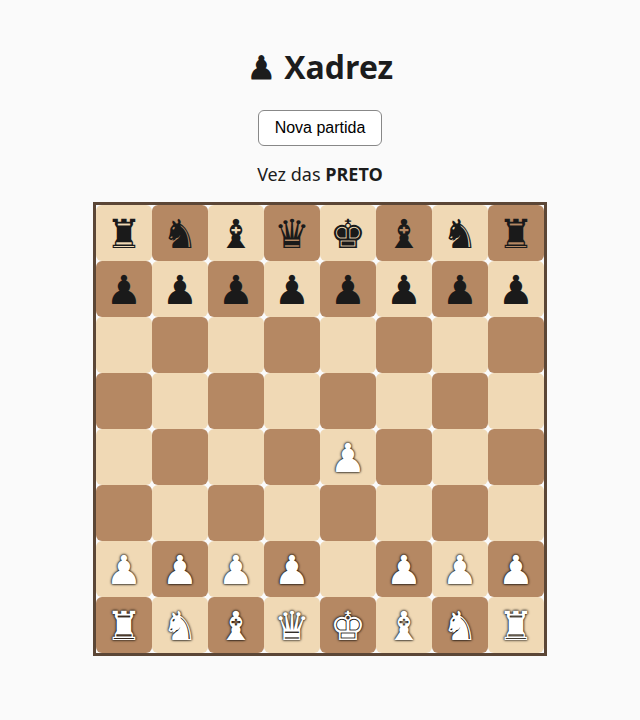

# ♟ Xadrez — Jogo de xadrez full-stack

Jogo de xadrez completo e jogável no navegador, com **regras de verdade**
(xeque, xeque-mate, afogamento, roque, promoção e *en passant*). Projeto de
estudo focado em **Java + Spring Boot + Hibernate** no backend e **React +
TypeScript** no frontend.



## Stack

| Camada | Tecnologias |
|---|---|
| **Domínio** | Java 21 (POO pura, sem dependência de framework) |
| **Backend** | Spring Boot 3 (Web, Data JPA), Hibernate |
| **Banco** | H2 (desenvolvimento) · PostgreSQL (produção) |
| **Frontend** | React + TypeScript + Vite + TanStack Query |
| **Testes** | JUnit 5, MockMvc (56 testes) |

## Arquitetura (camadas com responsabilidades separadas)

```
Frontend (React)            → tabuleiro clicável, consome a API
        │ HTTP/JSON
Controller (@RestController) → recebe requisições, devolve DTOs
Service (@Service)           → orquestra os casos de uso
Domínio (Java puro)          → REGRAS do xadrez (Tabuleiro, Peca, Partida...)
Repository (Spring Data/JPA) → persiste as partidas no banco
```

> Decisão central: o pacote `dominio` **não conhece** Spring nem banco de dados.
> As regras do xadrez são independentes de framework — isso facilitou tanto os
> testes quanto a troca de banco (H2 → PostgreSQL) e a exposição via REST.

## Funcionalidades

- Todas as 6 peças com seus movimentos (Template Method para peças deslizantes/de salto)
- Detecção de **xeque, xeque-mate e afogamento**
- Regras especiais: **roque, promoção e *en passant***
- Validação de movimentos legais (não permite expor o próprio rei)
- API REST para criar partida, consultar estado e jogar
- Persistência das partidas (cada partida tem um id)

## Como rodar localmente

Pré-requisitos: **JDK 21**, **Maven** e **Node.js**.

```bash
# 1) Backend (porta 8080)
mvn spring-boot:run

# 2) Frontend (porta 5173) — em outro terminal
cd frontend
npm install
npm run dev
```

Abra **http://localhost:5173** e clique em **Nova partida**.

Quer jogar no terminal (sem frontend)? 
```bash
mvn -q compile
java -cp target/classes com.mateusferreira.xadrez.console.JogoConsole
```

## Testes

```bash
mvn test
```

## API (resumo)

| Método | Rota | Descrição |
|---|---|---|
| `POST` | `/partidas` | Cria uma partida nova |
| `GET` | `/partidas/{id}` | Estado atual da partida |
| `POST` | `/partidas/{id}/jogadas` | Faz uma jogada (`{ "origem": "e2", "destino": "e4" }`) |

## Deploy

Instruções de produção (Vercel + Railway + PostgreSQL) em [`DEPLOY.md`](DEPLOY.md).

## Créditos

- Peças de xadrez (SVG): conjunto **cburnett**, por Colin M. L. Burnett (Wikimedia Commons), sob licença livre (GFDL/BSD/GPL).
